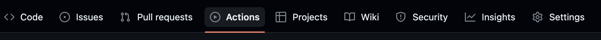
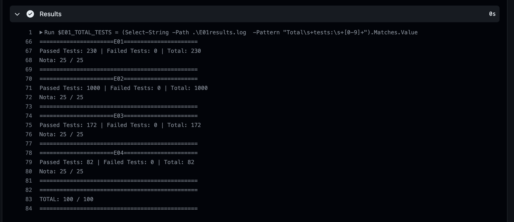

# Segunda Convocatoria

- [Segunda Convocatoria](#segunda-convocatoria)
  - [Instrucciones](#instrucciones)
  - [Introducción](#introducción)
  - [Ejercicio 01 (**20 puntos**)](#ejercicio-01-20-puntos)
    - [Ejemplo 1.1](#ejemplo-11)
    - [Ejemplo 1.2](#ejemplo-12)
      - [Restricciones](#restricciones)
  - [Ejercicio 2 (**30 puntos**)](#ejercicio-2-30-puntos)
    - [Ejemplo 2.1](#ejemplo-21)
    - [Ejemplo 2.2](#ejemplo-22)
    - [Ejemplo 2.3](#ejemplo-23)
    - [Restricciones](#restricciones-1)
  - [Ejercicio 3 (**30 puntos**)](#ejercicio-3-30-puntos)
    - [Ejemplo 3.1](#ejemplo-31)
    - [Restricciones](#restricciones-2)

## Instrucciones

1. Para iniciar, debe crear un *Fork* del repositorio:


2. Vaya la pestaña de **actions** de su repositorio. Si ve un botón verde, haga clic en él para poder ejecutar las pruebas en el futuro.



3. Clone el nuevo repositorio en su computadora y ábralo en Visual Studio.

4. En el menú de Visual Studio, en la sección de *Build* o *Compilar*, construya la solución.

5. En el menú de Visual Studio, en la sección de Tests, seleccione *Run All Tests*

6. La mayoría de las pruebas deberían fallar.

## Introducción

- Todos los ejercicios deben compilar para poder ser probados. Si por lo menos uno de los ejercicios no compila, la nota será cero.
- Si el código original de un ejercicio no se modifica o la intención de su resolución no es clara, la nota del ejercicicio será de cero puntos, aún si hay pruebas que sí pasen para dicho ejercicio.
- NO agregue nuevos métodos `main()`, de lo contrario ninguna prueba podrá ejecutarse.
- NO cambie la firma de los métodos existentes (no agrege más parámetros ni cambie el nombre), estos son utilizados para probar su código.
- NO haga cambios en las pruebas, esto resulta en un 0 inmediato.
- Para este examen parcial está prohibido utilizar librerías de estructuras de datos lineales como `stack`, `queue`, `list`, etc. Usted debe implementar sus propias estructuras de datos.
- Puede agregar nuevas clases y/o archivos, como sea necesario.
- Las definiciones de funciones y atributos de las clases se encuentran en archivos `.h`, pero debe implementar las funciones dentro de los `.cpp` equivalentes.
- A continuación encontrará los enunciados de cada uno de los ejercicios. Su nota en cada uno de los ejercicios será la relación entre la cantidad de pruebas que sí pasen sobre la cantidad total de pruebas para ese ejercicio.
- En la pestaña de **Actions** podrá ver como las pruebas se ejecutan con su código implementado (si hace `git push` previamente). En los últimos pasos, puede ver los resultados y su nota:


___

## Ejercicio 01 (**20 puntos**)

Dado `n` pares de parentésis, implemente una función que retorne **todas** las posibles combinaciones de parentésis *correctamente formados*.

### Ejemplo 1.1

    n = 3
    resultado = ["((()))","(()())","(())()","()(())","()()()"]
___

### Ejemplo 1.2

    n = 1
    resultado = ["()"]
___

#### Restricciones

```1 <= n <= 8```

## Ejercicio 2 (**30 puntos**)

Dada lista enlazada de longitud `n` en la cual cada nodo tiene un apuntador adicional, `random`, que apunta a cualquier nodo de la lista o a `nullptr`.

Relice una **copia profunda** de la lista. Esta copia profunda debe consistir de exactamente `n` **nodos completamente nuevos**, en donde el valor de cada uno de los nodos tiene el mismo valor del nodo correspondiente. Tanto el apuntador `next` como el apuntador `random` de los nuevos nodos deben apuntar a los nuevos nodos en la lista copiada de tal manera que los apuntadores en la lista original y en la lista copiada representan estados idéntidos. Ninguno de los apuntadores en la nueva lista debe apuntar a nodos en la lista original.

Por ejemplo, si existen dos nodos `X` y `Y` en la lista original, donde `X.random --> Y`, entonces los nodos copiados `x` y `y` en la lista nueva deben ser `x.random --> y`;

Retorne el nodo **head** de la lista enlazada copiada.

La función `copyList()` recibirá como parámetro únicamente el nodo `head` de la lista original.

### Ejemplo 2.1


### Ejemplo 2.2


### Ejemplo 2.3


### Restricciones

- **0** <= `n` <= **1000**
- **-10<sup>4</sup>** <= `Node<int>.val` <= **104**
- `Node<int>.random` apunta a `nullptr` o a algún nodo dentro de la lista enlazada.

## Ejercicio 3 (**30 puntos**)

Diseñe una pila (stack) en la que se pueda hacer push, pop, top y encontrar el menor elemento en **tiempo constante**.

Implemente la clase `MinStack` que se encuentra en `Ejercicio03.h` y `Ejercicio03.cpp` con las siguientes funcionalidades:

- `MinStack()` crea e instancia un objeto de MinStack.
- `void push(int value)` agrega el elemento **value** a la pila.
- `void pop()` elimina el último elemento en ser agregado a la pila.
- `int top()` retorna el último elemento en ser agregado a la pila (sin eliminarlo).
- `int getMin()` retorna el menor elemento en la pila.

Su solución debe resolver cada función con complejidad de tiempo `O(1)`.

Para resolver este problema, debe implementar una estructura de datos lineal y de tamaño dinámico. No puede utilizar `stack`, `list`, `queue`, ni ninguna librería con estructuras de datos lineales. Usted debe implementar su propia estructura.

### Ejemplo 3.1

```C++
    MinStack* minStack = new MinStack(); // []
    minStack->push(-2); // [-2]
    minStack->push(0); // [0, -2]
    minStack->push(-3); // [-3, 0, -2]
    minStack->getMin(); // return -3
    minStack->pop(); // elimina (-3) -> [0, -2]
    minStack->top();    // return 0
    minStack->getMin(); // return -2
```

___
### Restricciones

- -2<sup>31</sup> <= value <= 2<sup>31</sup>
- Las funciones `pop()`, `top()` y `getMin()` siempre serán llamadas en pilas no vacías.
- La cantidad de llamadas a `push()`, `pop()`, `top()` y `getMin()` no excederá 3*10<sup>4</sup>.